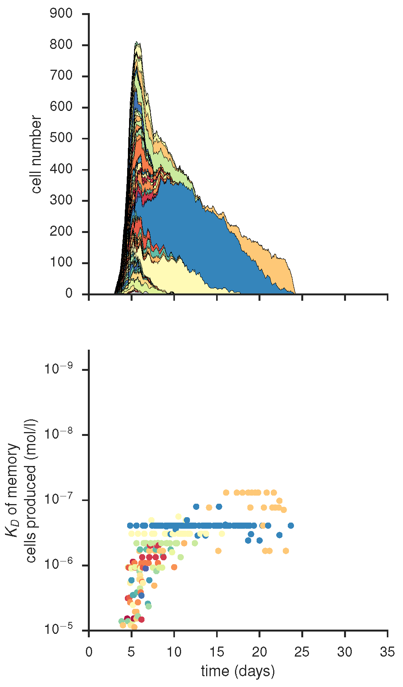
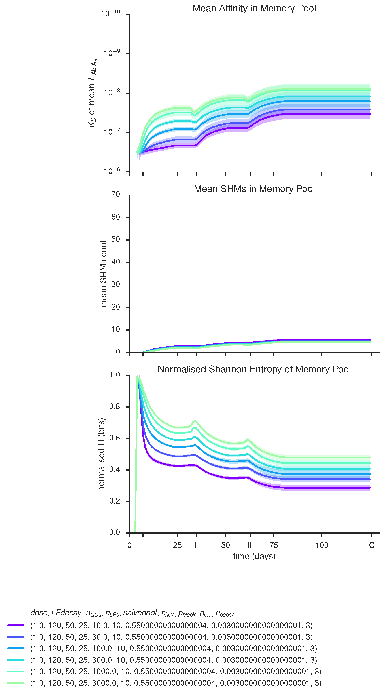

# gc_memo
1. [What is this?](#1-what-is-this)
2. [Structure and Requirements](#2-structure-of-the-project)  
    a. [Which file does what?](#2a-which-file-does-what)  
    b. [(module) Versions used](#2b-module-versions-used)  
3. [Getting started](#3-getting-started)    
    a. [Setting simulation parameters](#3a-setting-simulation-parameters)  
    b. [Running simulations](#3b-running-simulations)
4. [Simulation examples](#4-simulation-examples)
5. [Caveats](#5-caveats)
6. [Contact](#6-contact)

***

## 1. What is this?
`gc_memo` is an agent-based simulation project aiming at simulating the humoral immune response to vaccination. The simulation consists of one to N germinal centres (agglomerations of immune cells that form upon infection and play an important role in the selection, maturation and differentiation of B cells, GCs) embedded in a pool of free naive and memory B cells which can be activated to form GCs upon infection. The simulation was developed to understand single-cell data derived from a human malaria immunisation study, but aims to describe B cell immune responses in a more general sense. It therefore allows the alteration of key parameters of a vaccination protocol (e.g. number of booster vaccinations, time between them, dose) as well as infection specific parameters (e.g. duration of the GC reaction, complexity of the antigen displayed to the immune system) and potentially patient specific parameters such as the frequency and quality of potential precursor cells.

As a teaser, you can watch this [video showing the evolution of B memory cell binding energy distributions over the time course of a vaccination](https://youtu.be/0YMurVlQhGk), which was compiled from simulation output of `gc_memo`.

***

## 2. Structure of the project
The project is built in python 2.7 and structured into five main files as described below. The code was tested using the module versions as listed here. For a mechanistic summary of what the simulation does, please check out the file `gc_pseudocode.pdf`.


### 2a. Which file does what?
* `gc_memo.py` contains the actual simulation; the function `main()`
contains the main simulation loop. If the simulated data is stored as a file, this ends up in the folder '/raw_data'.

* `gc_head.py` contains some useful wrappers which run the simulation for a given set of parameters and produce plots from the resulting data, see also [Getting started](#3-getting-started) for use cases. Processed data from here (e.g. means of several simulations) end up int the folder '/processed_data'.

* `cf.py` contains all required simulation parameters which can be altered by the user as well as some information necessary for modelling antibody mutation and binding.

* `gc_plots.py` contains plotting functionality - most of the plots should usually be called via one of the functions in gc_head.py, but others can/must be called directly, see also [Simulation examples](#4-simulation-examples) for more information. All plots produced are saved to '/figures'.

* `gc_maps.py` contains functions useful for running larger parameter scans and also for analysing their results. Results of these scans are saved to '/map_data', as their format is more compressed than the complete simulation data stored in '/raw_data'.

### 2b. (module) Versions used
* python 2.7.12 |Anaconda 2.2.0 (x86_64)| (default, Jul  2 2016, 17:43:17) [GCC 4.2.1 (Based on Apple Inc. build 5658) (LLVM build 2336.11.00)]

* matplotlib 1.5.1
* numpy 1.11.0
* pandas 0.16.2
* scipy 0.17.0
* seaborn 0.7.0

***

## 3. Getting started
Clone the repository and navigate into the '/gc_memo' folder containing the code. As a suggestion, `gc_memo` is easy to use in an interactive python environment such as IPython. For starting directly (in IPython), run the head-file
```
#!python

%run gc_head.py
```
and call the function
```
#!python

small_scale()
```
After a few seconds, your first simulated germinal centre should pop up on the screen and your plots are saved to your '\figures' folder.

### 3a. Setting simulation parameters
The most important parameters that users may want to change regard vaccination schedule, antigen specifics, vaccinee specifics and simulation size which are discussed below. The default values and justification for them can be found in the file `default_params.pdf`. In order to change parameters, do so directly in `cf.py` and then rerun the file from which you are calling the simulation, i.e. `%run gc_head` or `%run gc_maps` - this will reload the parameter file.

* **Vaccination schedule**  
 Until which day to run the whole simulation, here day 60

        endtime = 60*12
 Time points on which to vaccinate/put antigen into the system, here on days 0 and 30

        tinf = [0*12, 30*12]
 Dose of antigen to be given at each of the boosters, values between 0 and 1, here 100% at both time points

        dose = [1, 1]

* **Potentially infection/antigen specific parameters**  
 Number of key positions in the antibody/antigen binding interface (complexity of the antigen or difficulty of the challenge to the humoral immune system), here 10

        nkey = 10
 Parameters governing the size of the GC over time, specifically until which day it remains at maximum size and how fast it disappears afterwards

        tmax = 7*12
        LFdecay = 10*12

* **Patient-specific parameters**  
 Maximum normalised binding energy towards the antigen in naive cells (i.e. before affinity maturation) - even if allowing naive cells to have ideal affinity in principal (`upperlim = 1`), they still appear extremely rarely in the binding model implemented here, but more stringent cut offs are possible, e.g.

        upperlim = 0.65
 Number of freely available naive and memory B cells in the complete system with at east threshold affinity to the antigen, partly governs how many cells are activated to seed each GC (but is not euivalent ot the number of seeders!). It is useful to give these numbers per GC to facilitate scaling the simulation, here 1000 naive cells and 100 previously existing memory cells per GC

        naive_pool = 1000 * nGCs
        memory_pool = 100 * nGCs

* **Simulation size**  
 Number of GCs to consider jointly - depending on where the emphasis of the analysis lies (e.g. effects of other parameters on proceedings in individual GCs or more realistic system with many interacting GCs), a different number of GCs can be chosen, here 50

        nGCs = 50
Size of the GCs, given by the number of T follicular helper cells in there which act as limiting factors for B cell survival. The number of resulting B cell depends on many parameters such as their death and differentiation rates, but for the default parameters 25 Tfh cells result in approx 500 B cells

        nLFs = 25


### 3b. Running simulations
The file `gc_head.py` contains a number of simple-to-run functions that contain simulation and analysis plots. These are:

* `small_scale()` for looking at each individual GC within small simulations, i.e. up to 10 GCs at the most.

* `TUCHMI_sampling()` imposes the vaccination schedule for which this project was developed, but this can easily be altered. As it samples from the simulation data and displays sample statistics, it is especially useful for larger (more "physiological") simulations with e.g. 50 or more GCs.  

* `selection_vs_mutation()` and `stacked_mutations()` both allow to visualise the contributions of the two main processes shaping the memory B cell repertoire: selective expansion of high-quality precursors and intraclonal improvement via somatic hypermutations.  

For more advanced examples, see also the collection of available plots in [Simulation examples](#markdown-header-4-simulation-examples).

***

## 4. Simulation examples <a name="4-simulation-examples"></a>
This section contains a sample of plots produced with gc_memo with instructions on how to access them. The examples shown below were genrated for the sake of demonstration, they do not represent scientific results in any way.

Population dynamics plot, produced by `gc_plots.population_plot()` via calling `gc_head.small_scale()`

Clonal composition of individual GC and quality of its memory output, produced by `gc_plots.GC_dynamics_plot()` via `gc_head.small_scale()`

... and affinity of mutational status within the GC dominating clone of the GC shown above, produced by `gc_plots.GC_dynamics_plot()` via `gc_head.small_scale()`

Mean cell and clone number in individual GCs with mutational load per clone, produced by `gc_plots.oneGC()` via `gc_plots.oneGC()`

Histograms of unselecetd, selected and mutated repertoires, produced by `gc_plots.energy_distributions_plot()` via `gc_head.selection_vs_mutation()`


Scatter plot of current versus ancestral affinity with marginal histograms, produced by `gc_plots.energy_scatter_plot()` via `gc_head.selection_vs_mutation()`


Stacked energy distribution histograms showing cells with unchanged, improved and impaired affinities, produced by `gc_plots.stacked_energy_plot()` via `gc_head.stacked_mutations()`


Mean SHM and clonal expansion in samples of a given size over vaccination trial time course, produced by `gc_plots.sample_statistics_plot()` via `gc_head.TUCHMI_sampling()`

Scatter plots of affinity over mutational status in polyclonal samples at TUCHMI sampling timepoints I, II and III, produced by `gc_plots.sample_scatter_plot()` via `gc_head.TUCHMI_sampling()`

Time course of mean binding energy of the memory pool, produced by `gc_plots.pool_affinity_plot()` via `gc_head.TUCHMI_sampling()`

Comparison of affinity improvement within individual GCs for different numbers of key positions, produced by `gc_plots.AM_effect_plot()` via `gc_head.AM_effect_nkey()`

Time course of antigen presence in the system and number of limiting factors (Tfh cells) at the GC site, produced by `gc_plots.Ag_LF_plot()` via `gc_plots.Ag_LF_plot()`

Comparison of affinity, SHMs and entropies for a given varying parameter (here size of the naive precursor pool) on the basis of pre-simulated data from one or several runs of `gc_maps.map_params()`, produced via `gc_maps.aff_time_plot_mean()`

***

## 5. Caveats
Please be aware of the following points when using this code:

* If you set the parameters of the binding model's energy mapping to values other than their defaults, i.e. `thr = 0.6`, `upperlim = 1`, `Elow = -11.5` and `Ehigh = -20.7`, you are likely to get incorrect plots where affinity scales are involved. This is because (currently) the affinity labels of the plots are hardcoded specific to the default settings and do not adapt to changes. The actual simulation as well as plots that do not contain affinity values (KD) are unaffected by this.

* Some of the wrapper functions in `gc_head.py` overwrite parts of the parameters given in `cf.py`, for example the vaccination schedule when using `TUCHMI_sampling()`. This is intended to make these use cases easier, but remember it in case you are wondering why your simulation does not conform to your input parameters.

* The simulation runs in time steps of two hours which has to be taken into account when setting parameters - all times need to be given in these units. This means that a simulation protocol until day 30 needs to be set to `endtime = 30*12` as there are 12 units of 2 hrs in a day etc.

* Running large simulations (order of >10 GCs, 10k B cell objects) with the storage options 'datafile' or 'dictionary' requires a lot of memory (potentially GB's). In cases where this is not practical, e.g. when scanning parameter sets on computational clusters, the option 'minimal' should be used - it stores summary statistics on the B cell pool at every time point instead of individual object information and thus requires much less memory.

***

## 6. Contact
If you

* have comments, constructive criticism and suggestions concerning this project,

* want to participate in improving the simulation, both technically and biologically,

* have vaccination data that you think could help improve the model or be understood using it,

please feel free to contact me via email (l.buchauer@dkfz.de) or Twitter (@LiBuchauer) or visit our group's website, the [Division of Theoretical Systems Biology at DKFZ](https://nibelung.bioquant.uni-heidelberg.de/Welcome.html)!
